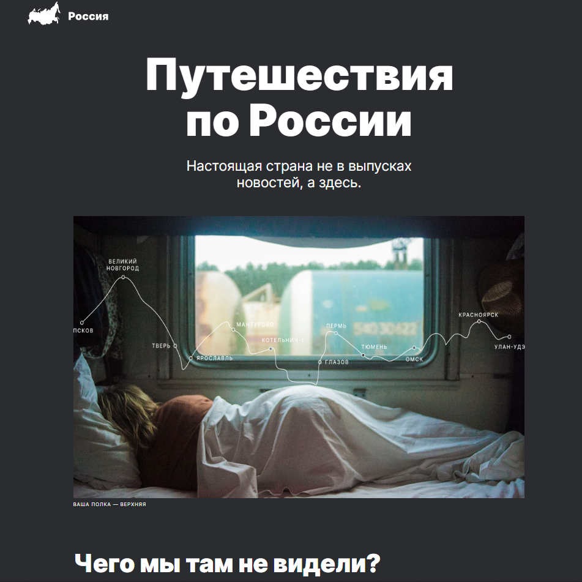
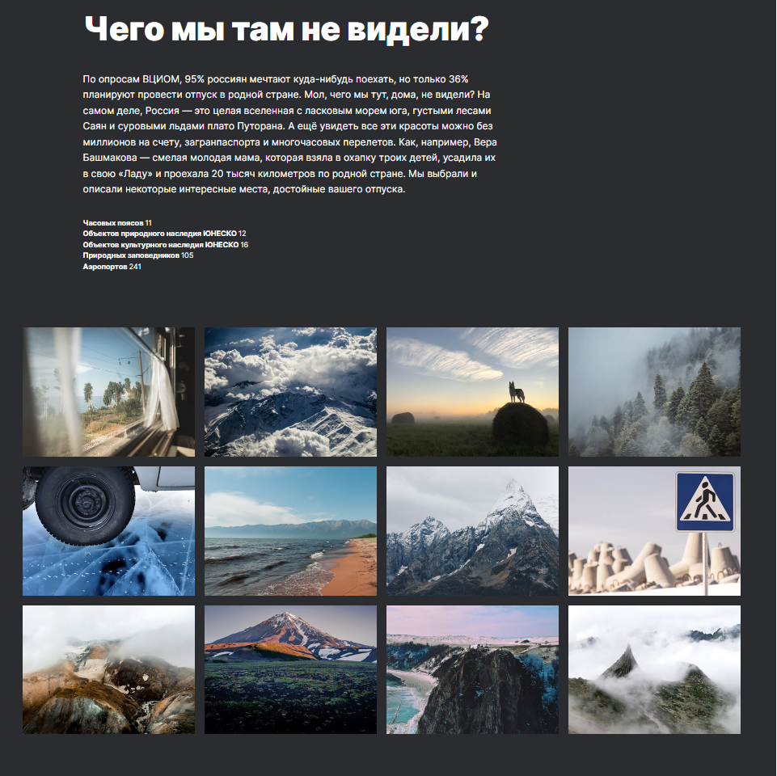

# Второй проект Ивановской Юлии: Путешествие по России

### Это второй одностраничный сайт, созданный мной при прохождении курса "Веб-разработчик" от Яндекс Практикума. Он содержт информацию о путешествиях по России. Впервые верстка осуществлялась по макету (Figma).

В работе использованы технологии HTML и CSS:

- Flexbox и Grid Layout
- медиазапросы (адаптивная верстка)
- позиционирование
- продвинутая семантика языка HTML
- фрэймы
- анимация
- работа с изображениями и шрифтами

  &nbsp;
  &nbsp;

Ссылка на сайт: https://jul0706.github.io/russian-travel/index.html
